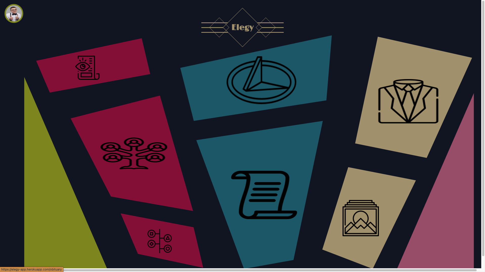
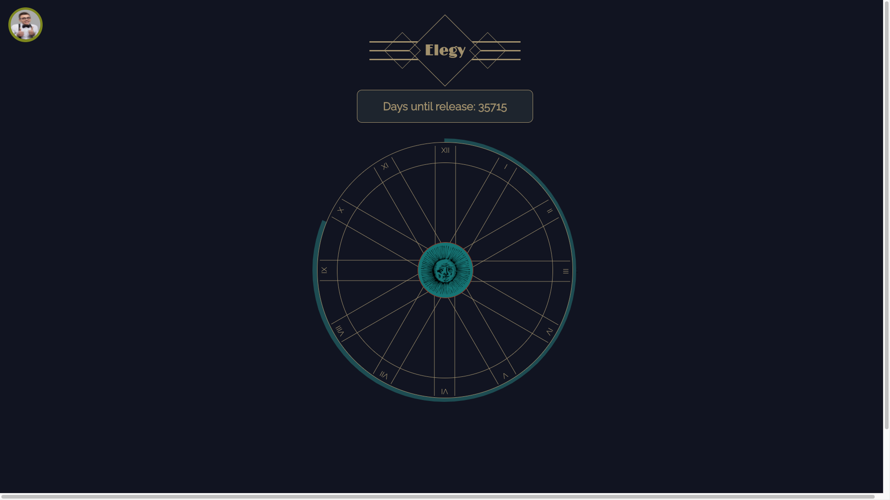
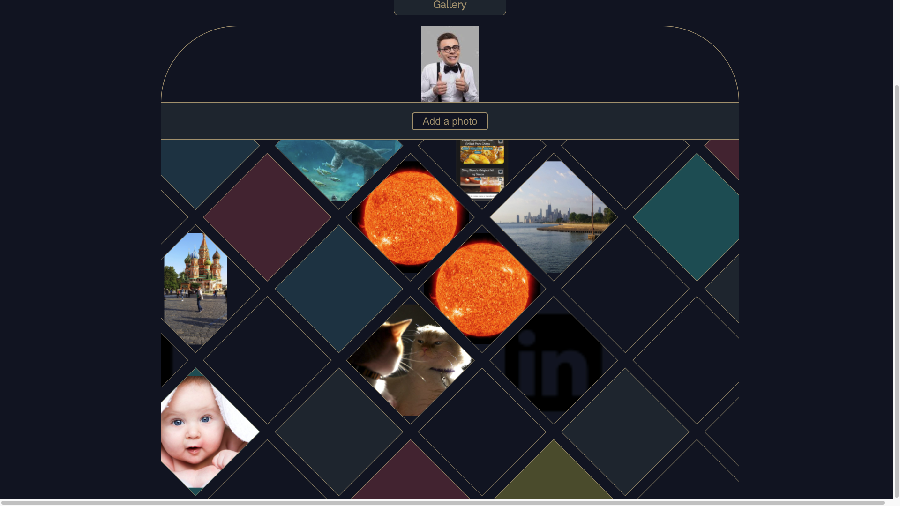
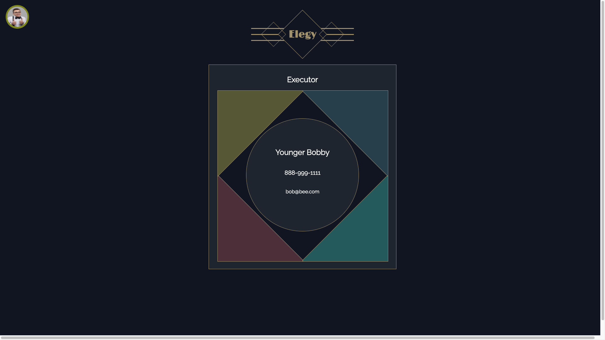
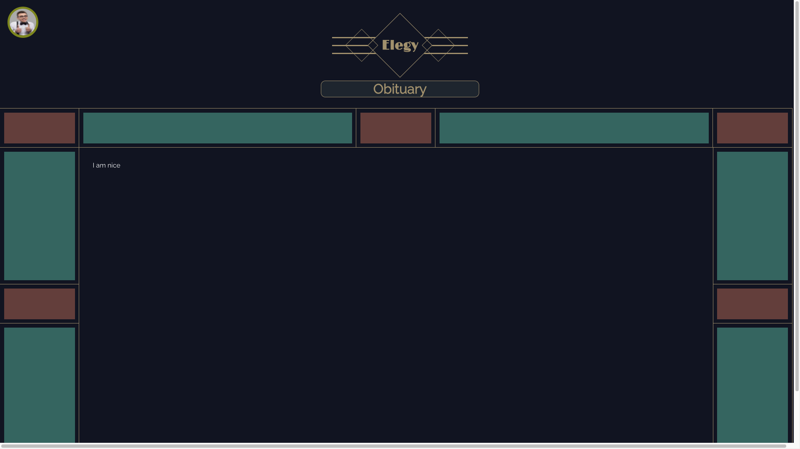
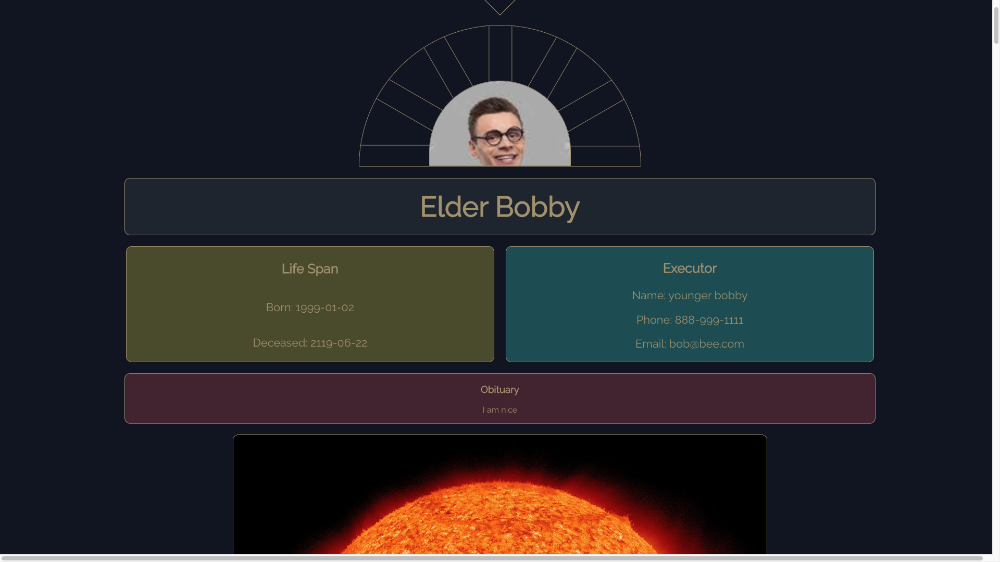

# [Elegy](https://elegy-app.herokuapp.com/)
## Deployment Status: 

### Table of Contents
- [Overview](#overview)
- [Installation & Viewing](#installation-and-viewing)
- [Technologies Used](#technologies-used)
- [Sample Profile](#sample-profile)
- [Functionality](#functionality)
- [Future Additions](#future-additions)
- [Authors](#authors)

## Overview 

  The Elegy app allows users to create their own memorial pages. Users can create lasting gifts to their loved ones by curating photos and memories, and can be remembered in the way they'd like by writing their own obituary. Users select 'executors' who will be able to share the user's memorial page upon the user's death, and also select recipients who are to be notified upon the user's death. This allows the user's next of kin to notify a user-curated list of people upon the user's death with the push of a button, helping to eliminate an emotionally draining task from an already difficult time.

  The Elegy app interfaces with a custom-built REST API on the backend to store users, their photos, their executors and recipients.

## Installation and Viewing 

This application is deployed to Heroku. You may view the live application [here](https://elegy-app.herokuapp.com/)

To view this application on your local device:

- Clone down this repository
- Run `npm i` in your terminal
- Run `npm start` in your terminal
- To view Cypress tests open a separate tab in your terminal and run `npm run cypress`

### Technologies Used

 
    
    
    
    
    

## Sample Profile 
  

  

  

  

  

  

---

## Functionality

## Future Additions
  * Add user creation page
  * Add sessions library to manage login status
  * Add recipients creation/management view

### Authors
- [Taylor Galloway](https://github.com/tylrs)

**************************************************************************

**[Back to top](#table-of-contents)**